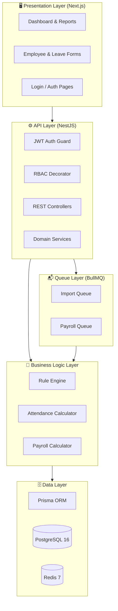
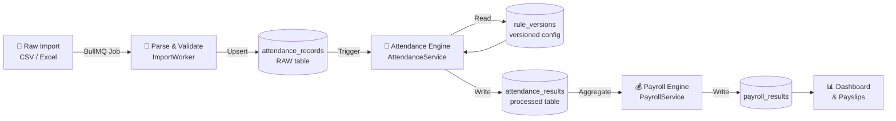
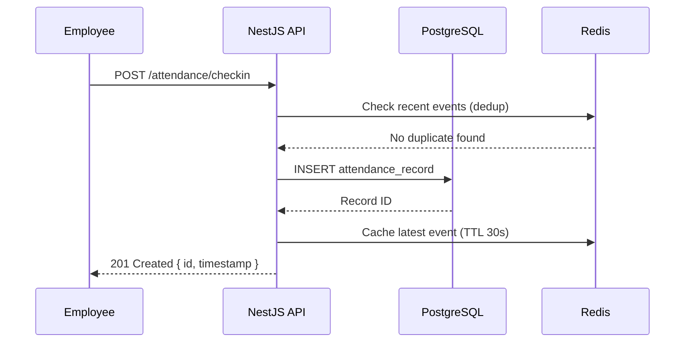
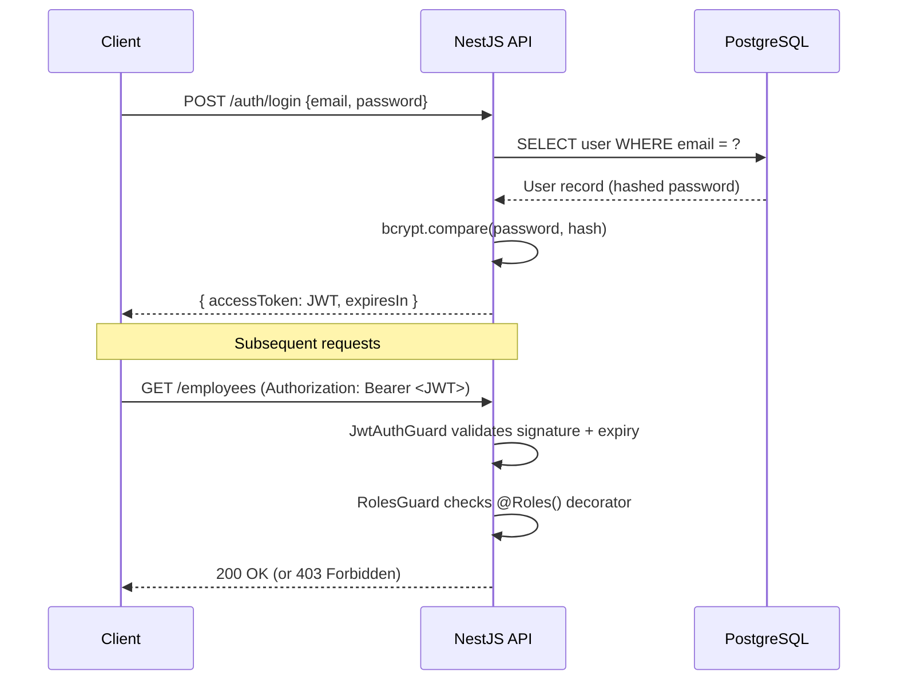
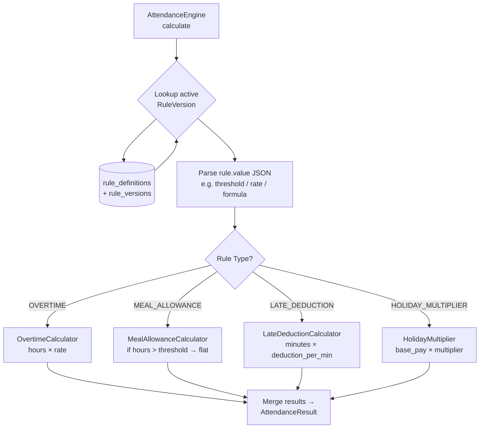
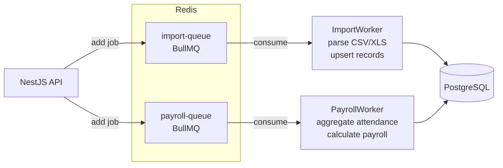

# Architecture – HR Attendance & Payroll Engine

> **Version:** 1.0.0 | **Last Updated:** 2026-07

---

## Table of Contents

1. [System Overview](#1-system-overview)
2. [Architecture Layers](#2-architecture-layers)
3. [Data Flow](#3-data-flow)
4. [Technology Stack](#4-technology-stack)
5. [Security Model](#5-security-model)
6. [Rule Engine](#6-rule-engine)
7. [Queue Architecture](#7-queue-architecture)
8. [Scalability Notes](#8-scalability-notes)

---

## 1. System Overview

The **HR Attendance & Payroll Engine** is a **Metadata-Driven** platform that decouples business rules from application code. HR policies (overtime rates, allowance thresholds, late-deduction formulas) are stored as versioned configuration records in the database, enabling policy changes without redeployments.

```
┌─────────────────────────────────────────────────────────┐
│                    HR Payroll System                    │
│                                                         │
│  ┌──────────────┐   REST/HTTP   ┌─────────────────────┐ │
│  │  Next.js UI  │ ◄──────────► │   NestJS Backend    │ │
│  │  (Port 3001) │               │    (Port 3000)       │ │
│  └──────────────┘               └────────┬────────────┘ │
│                                          │              │
│                           ┌──────────────┼────────────┐ │
│                           │              │            │ │
│                    ┌──────▼──────┐  ┌────▼──────┐    │ │
│                    │  PostgreSQL  │  │   Redis   │    │ │
│                    │    (5432)   │  │   (6379)  │    │ │
│                    └─────────────┘  └───────────┘    │ │
│                                                       │ │
└───────────────────────────────────────────────────────┘ │
```

---

## 2. Architecture Layers



---

## 3. Data Flow

### 3.1 Attendance Import → Payroll Output



### 3.2 Real-Time Check-In Flow



---

## 4. Technology Stack

| Layer | Technology | Version | Purpose |
|---|---|---|---|
| **Frontend** | Next.js | 14.x | SSR/CSR React dashboard |
| **UI Components** | shadcn/ui + Tailwind | latest | Design system |
| **Backend** | NestJS | 10.x | Modular API framework |
| **Language** | TypeScript | 5.x | Type safety across full stack |
| **ORM** | Prisma | 5.x | Type-safe database access |
| **Database** | PostgreSQL | 16 | Primary data store |
| **Cache / Queue** | Redis | 7 | Session cache + BullMQ jobs |
| **Job Queue** | BullMQ | 4.x | Background import & payroll jobs |
| **Auth** | JWT + Passport | — | Stateless authentication |
| **Containerization** | Docker + Compose | 27.x | Local & production runtime |
| **CI/CD** | GitHub Actions | — | Automated testing and image builds |

---

## 5. Security Model

### 5.1 Authentication



### 5.2 Role-Based Access Control (RBAC)

| Role | Permissions |
|---|---|
| `SUPER_ADMIN` | Full access to all resources including company settings |
| `HR_MANAGER` | Manage employees, approve leaves, run payroll |
| `PAYROLL_OFFICER` | Read attendance results, generate payslips |
| `DEPARTMENT_HEAD` | View/approve leaves for their department only |
| `EMPLOYEE` | View own records, submit leave requests |

### 5.3 Security Hardening

- All Docker containers run as **non-root** users (`nestjs:1001`, `nextjs:1001`)
- Secrets injected via **environment variables**, never hard-coded
- Database credentials scoped to the application user (not `postgres` superuser in production)
- HTTP-only cookies for JWT refresh tokens (planned)
- Rate limiting on `/auth/*` endpoints

---

## 6. Rule Engine

The Rule Engine is the core differentiator. Instead of hard-coded `if/else` logic, every HR policy is stored as a versioned database record.



### Rule Value Schemas (examples)

```json
// OVERTIME_RATE
{ "threshold_hours": 8, "rate_multiplier": 1.5 }

// MEAL_ALLOWANCE
{ "min_hours_worked": 6, "allowance_amount": 50, "currency": "THB" }

// LATE_DEDUCTION
{ "grace_minutes": 10, "deduction_per_minute": 5, "currency": "THB" }

// PUBLIC_HOLIDAY_MULTIPLIER
{ "base_multiplier": 2.0, "ot_multiplier": 3.0 }
```

Changing a policy is as simple as inserting a new `RuleVersion` row with a future `effectiveFrom` date — no code change, no deployment.

---

## 7. Queue Architecture



| Queue | Worker | Concurrency | Purpose |
|---|---|---|---|
| `import-queue` | `ImportWorker` | 2 | Parse and persist bulk CSV/Excel uploads |
| `payroll-queue` | `PayrollWorker` | 1 | Sequential payroll run per period |

---

## 8. Scalability Notes

| Concern | Current Approach | Scale-Out Strategy |
|---|---|---|
| **API Throughput** | Single NestJS instance | Horizontal scaling behind Nginx/ALB |
| **Database** | Single Postgres instance | Read replicas + PgBouncer connection pooling |
| **Job Processing** | BullMQ single-node | Multiple worker replicas sharing Redis queues |
| **File Imports** | In-memory parsing | Stream-based parsing + S3 staging for large files |
| **Cache** | Single Redis | Redis Cluster / Sentinel for HA |
| **Observability** | Structured console logs | OpenTelemetry → Grafana Loki + Tempo |
